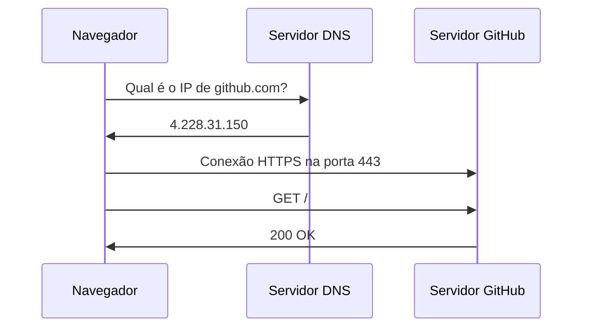

## Arquitetura da Aplicação

## O caminho de uma requisição



## Evidência do DNS

O domínio utilizado para o teste foi `github.com`.

```text
Servidor:  ns3.uninove.br
Address:   186.251.39.123

Não é resposta autoritativa:
Nome:      github.com
Address:   4.228.31.150
```

O comando `ping github.com` também retornou o endereço IP `4.228.31.150`, confirmando o resultado obtido pelo nslookup.

## Evidência do HTTP

Foram observadas as seguintes requisições na aba Network do navegador:

| Método | Recurso | Status |
|---|---|---|
| GET | user.json | 200 |
| GET | 3021.a31bef50d0106261.module.css | 200 |
| GET | 24934-b51ccdf5ff11933b.js | 200 |
| GET | github-desktop.svg | 200 |

Também foi realizado um teste acessando uma página inexistente no GitHub. O servidor retornou o código HTTP `404`, indicando que o recurso solicitado não foi encontrado.

## Cabeçalhos HTTP

Na análise dos cabeçalhos foram encontrados:

- Host: `github.com`
- User-Agent: `Mozilla/5.0 (Windows NT 10.0; Win64; x64) AppleWebKit/537.36 (KHTML, like Gecko) Chrome/151.0.0.0 Safari/537.36`
- Content-Type: `image/svg+xml`

## Por que utilizar HTTPS?

O HTTPS é importante porque protege os dados enviados entre o navegador do paciente e o servidor. Em um formulário de agendamento podem ser enviados dados sensíveis, como nome, telefone, e-mail e informações sobre a consulta. O HTTPS utiliza criptografia para proteger essas informações durante a comunicação e reduzir o risco de interceptação por terceiros.